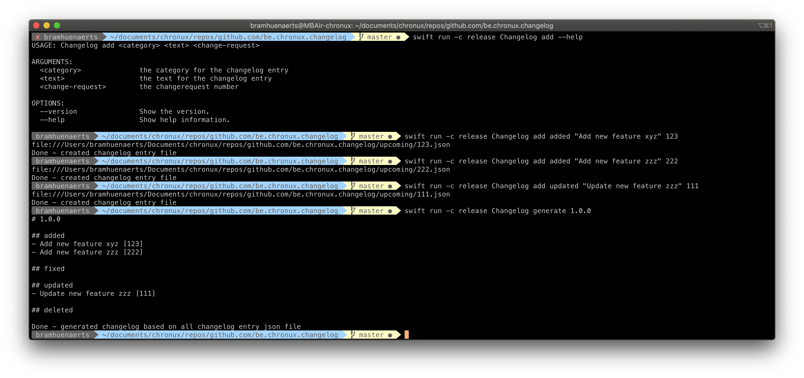

## Changelog

In large project, a changelog can easely lead into what we can call changelog merge hell. Each time one of the members would add a line, you will have to rebase or merge and fix the conflict.

The approach taken here will create a separate file into a folder named `upcoming`. Later on, when creating a release. We could use a construct command to create a changelog from all the individual files.

### Quick run

```
swift run -c release Changelog --help
```

### Demo



### Where is my XCode project?

- Run `swift package generate-xcodeproj` from project root.

note: run `open Package.swift` to open the package without project

### Tests

For running tests, just run `swift test`. 
